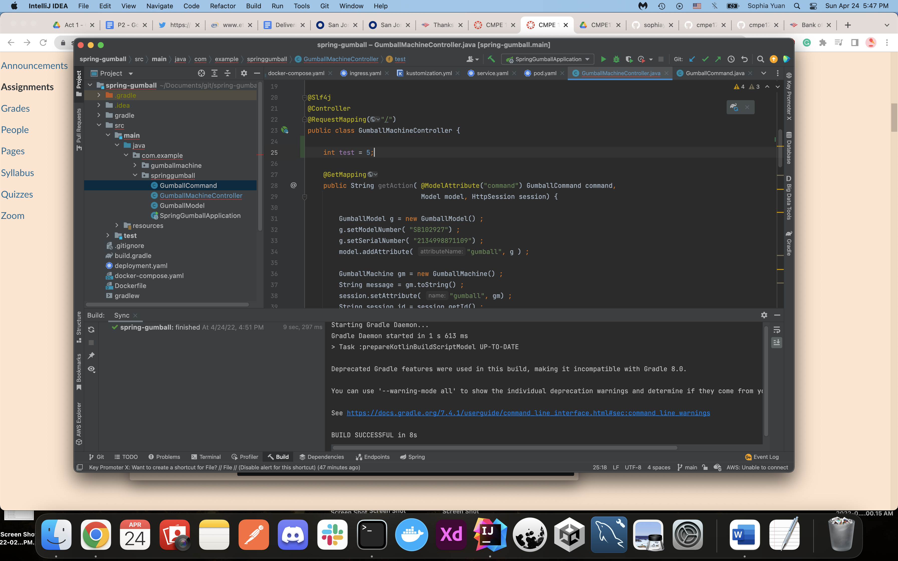
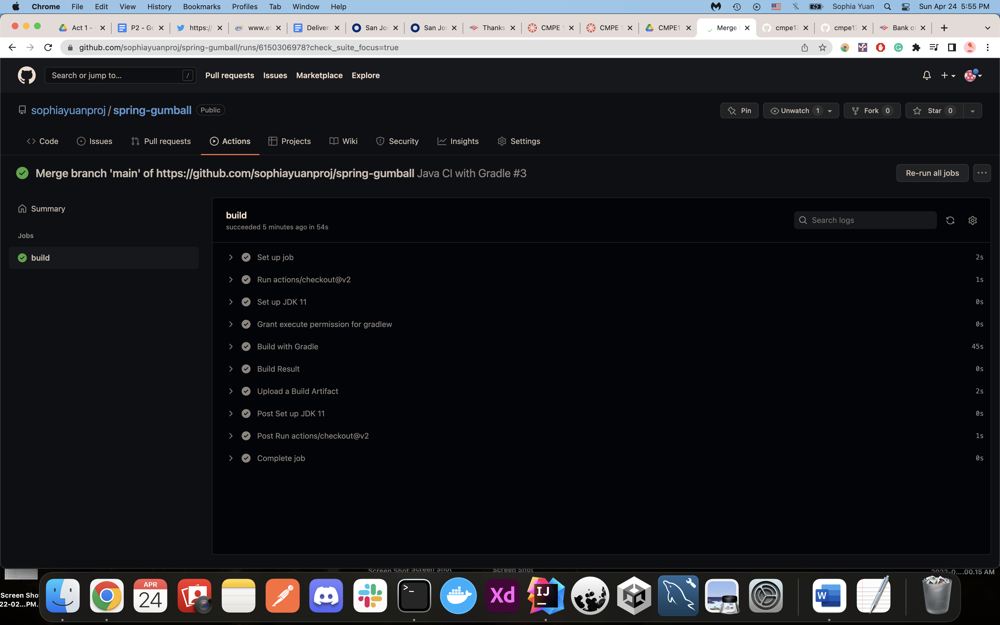
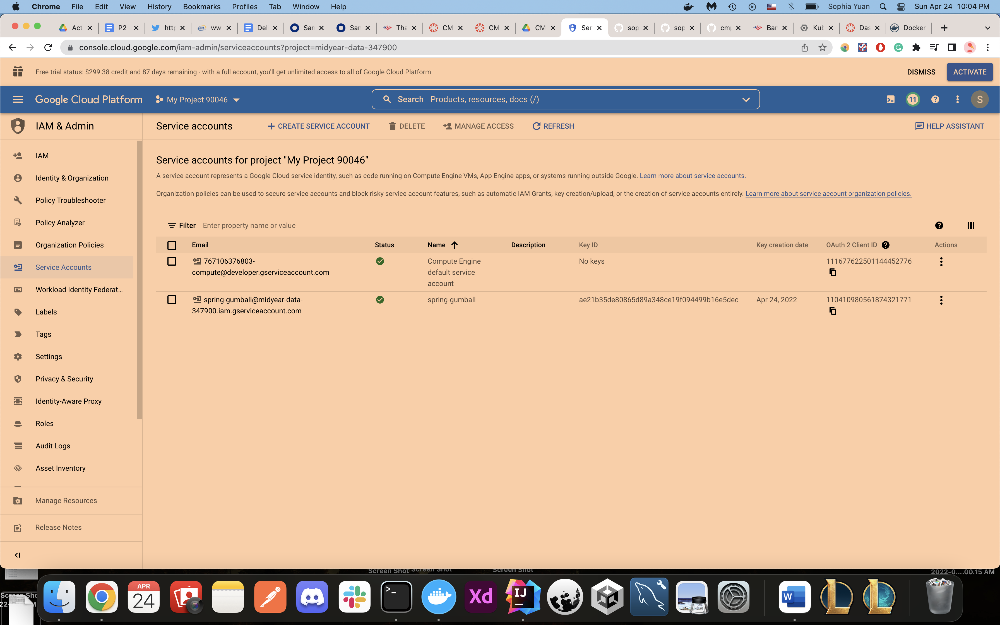

# CMPE 172 - Lab #10 Notes

Link to Lab 10 README that shows history (I was working on the README in that repo for the lab, this one is a copy): https://github.com/nguyensjsu/cmpe172-sophiayuanproj/tree/main/labs/lab10

(CD workflow will be set up on GKE)

## CI Workflow (Part 1)

CI- will merge code from multiple developers when they pull, which merges to the main branch off another branch. The point is to make sure there is nothing that will break the build, in doing so there will be unit tests.

First, I will use java with Gradle from the action options.

I have copied and pasted the file from the assignment.

This is the commit result after pressing start commit in the previous image. To explain the code here for the CI, the push and pull_request triggers request to main. Push is like pushing to the repo, or we can do a commit/pull_request from another branch that causes a change to main. This will trigger build, which runs on an ubuntu, which is a docker iamge to trigger the build. This will be built with java JDK 11, and it has the gradlew so it has the configurations in the repository. The output is a jar file, shown in the path field.

I have made this line change in the code and will be pushing it onto the repository.

This shows that my new build has succeeded and CI has been triggered.

## CD Workflow (Part 2)

An error I had was with the gradle version. It had to be upgraded from 5.6 to a newer version.

Therefore, I ran the command sdk install gradle 6.8 to get the new version.

Now, I was able to run make-build to build the image. Now, I will push it onto my public dockerhub account.

Now, I will build and deploy to GKE.

I added the repository field with spring-gumball though it was not shown in the professor lab 10 tutorial.

However, I am getting this error now, and will be working to fix it.

Kustomize references the GKE artifacts we want to build, which are the service and deployment. To do so, I have a kustomization.yml to reference it, and they will be manually applied to the Google CLI.

Here, I reference the image (built by the CD pipeline). CI will be triggered because we made a change to the main branch.

After creating the cmpe172 cluster, I will create service account.

A json key has been created and downloaded on to my desktop. Now, I will go onto github and put the key as a reference in the github as a key (GKE_PROJECT with the name as GKE_SA_KEY).

My google.yml file seemed to be generated differently than the professors, so this is the next section that can possibly be used to enter the key. To do so, we enter settings and modify secrets.

After our cluster cmpe172 has been created, we do not have to upload any files because it has all been done through the pipeline. The syntax seems to be different than the professors, since it has been renamed to push rather than release. On the push event, it will not be triggered when I update code (CI), it will trigger when I release (CD).

Here, I have created a new release.

However, my CD pipeline does not seem to have been updated. Therefore, I will try the older template from the assignment and change the values of GKE_ZONE, GKE_CLUSTER, IMAGE, and DEPLOYMENT_NAME.

To attempt to modify the error, I have updated the default google.yml file into the one from the assignment. I will now update the secrets.

These are the updated values.

Now, I will attempt to trigger a new release again.

Though it is showing up in the actions now, gradle build does not seem to work, so I will try to fix this issue.

I tried to change it back to 5.6 for the gradle version, but it would not let me redeploy. I have to stick with 6.8

I will try to update the version this way. After redeploying the image and pushing to docker, I will create a new release.

It  failed again because of the gradle version. I have also tried modifying the plugin in build.gradle to an older version, but the image failed to build.

Sites I used to help:
https://docs.spring.io/spring-boot/docs/current/gradle-plugin/reference/htmlsingle/
https://stackoverflow.com/questions/33346449/failed-to-apply-plugin-id-spring-boot

Though this portion requires 5.6, it seems like that the version cannot be used with the current springframework boot. If I update the version, it fails on google.yml. If I downgrade gradle to 5.6, the plugin complains. If I change the plugin to an older version, the program cannot build.

Now, I will try the professors version, 2.4.2 instead of 2.6.7. After doing so, I will now test a new release titled: New Release.

Though I have fixed this error, it seems like I need to set up credentials correctly.

Reference: https://serverfault.com/questions/1044638/sudden-permissions-denied-for-service-account
To fix this issue, I recreated the service account and updated the key. Now, it has permissions of: Owner. I also created a new release, release 4.

Now, I have gotten past the previous error and there is now an error in Publish. 

In attempt to fix the previous error, I added another role, called Cloud Build Service Account.
Reference: https://stackoverflow.com/questions/51873072/cant-push-image-to-google-container-registry-caller-does-not-have-permission

I have also created another key and will update the SA_KEY value. The cursor on the console image is pointing to the new account as well. Now, I will try the CD test again.

Images of the new release

I am still getting the same error, will try fixing again.

Reference: https://cloud.google.com/storage/docs/access-control/iam-roles
This time, when selecting roles, I chose manage roles and found access to these options. I selected these two to see if I can get rid of the error. I have additionally added the abilities into a custom role and will be adding it into the service account as well.

I have created the key here. The cursor shows the new service account made.

I will now update the SA_KEY and create a new release 6.

Alas, release 6 did not work, and I have tried it many times on other releases as well. Despite adding roles to the service account, nothing seemed to work, and the same error returned, even after I read documentation.

Reference: https://stackoverflow.com/questions/51873072/cant-push-image-to-google-container-registry-caller-does-not-have-permission

I even tried using auth configure-docker in console, but it still did not get rid of the error.

On my last try, this is the same error that I have been getting despite changing service roles to owner, storage bucket writer, and storage owner.

Because of these errors, I am unable to add in a load balancer and continue with Kubernetes.

